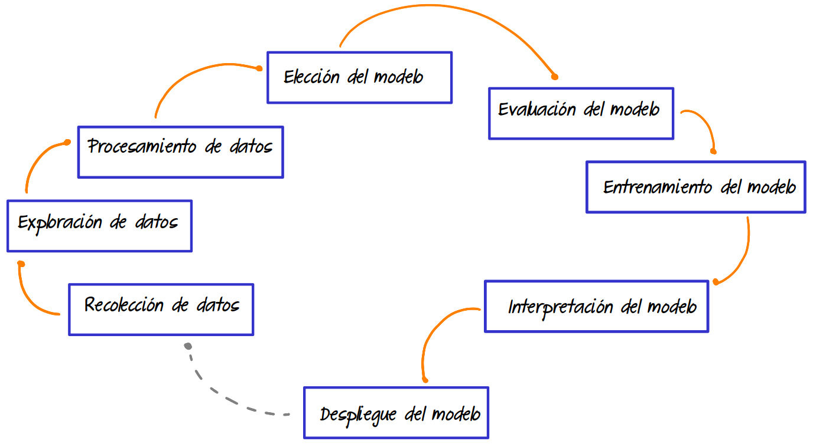

```{r setup, include=FALSE}
knitr::opts_chunk$set(echo = TRUE, comment = NA)

# library(summarytools)

```


</br></br>

```{r, echo=FALSE, out.width="100%", fig.align = "center"}
knitr::include_graphics("img/banner2.png")
```

</br>

En esta unidad se introduce el **modelo de regresión lineal simple** como aplicación de los temas anteriores : 

* Análisis exploratorio de datos
* Concepto de probabilidad
* Concepto de variable aleatoria
* Inferencia estadística : intervalos de confianza y pruebas de hipótesis paramétricas y no paramétricas

</br></br>

Contenido de la unidad: 

* **Correlación**
  * Análisis de correlación
  * Ceficiente de Pearson
  * Otros coeficientes
  * Código R - correlaciones
  
</br>  
  
* **Modelo**
  * Modelo de regresión lineal simple
  * Estimación de parámetros por el método de mínimos cuadrados ordinarios
  * Estimación de parámetros por el método de máxima verosimilitud
  * Supuestos del modelo
  * Transformaciones
  * Código R - estimación

</br>

* **Predicción**
  * Inferencia sobre el modelo
  * Inferencia sobre los parámetros
  * Inferencia sobre la variable respuesta
  * Código R - inferencia

</br></br>

Finalmente a través de una actividad se aplican los conceptos tratados en las unidades anteriores.

</br></br>

## <span style="color:#034A94">**Pasos para construir un modelo de Regresión Lineal Simple**</span>

</br></br></br>


```{r, echo=FALSE, out.width="80%", fig.align = "center"}

```

</br></br></br>

## <span style="color:#034A94">**Modelo estadístico**</span>
<div class="content-box-blue">

$$Y = \beta_{0} + \beta_{1} X +  \varepsilon $$
</div>

</br></br></br>

## <span style="color:#034A94">**Visualización del modelo**</span>

```{r echo=FALSE, fig.align='center', message=FALSE, warning=FALSE}
# Cargar la biblioteca ggplot2 (debe estar instalada previamente)
library(ggplot2)

# Crear un conjunto de datos de ejemplo
set.seed(123)
x <- rnorm(100)
y <- 2 * x + rnorm(100)

# Crear un marco de datos con los datos
data <- data.frame(x = x, y = y)

# Crear el gráfico de dispersión con la línea de regresión
ggplot(data, aes(x = x, y = y)) +
  geom_point(color = "#FF7F00", size = 3) +  # Personalizar color y tamaño de los puntos
  geom_smooth(method = "lm", se = FALSE) +    # Agregar la línea de regresión
  labs(x = "Variable independiente", y = "Variable dependiente", title = "Regresión Lineal Simple")

```


