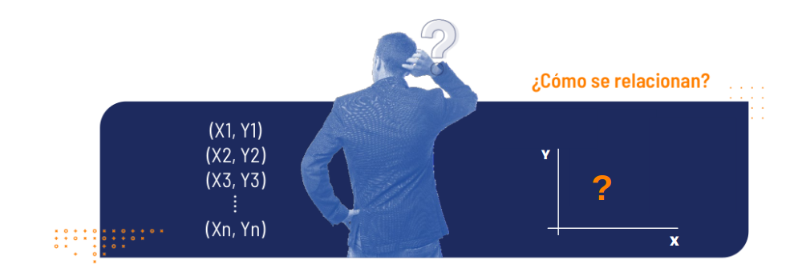

```{r setup, include=FALSE}
knitr::opts_chunk$set(echo = TRUE, comment = NA)

c1="#FF7F00"
c2="#FEB0C6"
c3="#034A94"
c4="#686868"
#-------------------------------------------------------------------------
library(tidyverse)
# install.packages("PerformanceAnalytics")
library(PerformanceAnalytics)


#install.packages("devtools") # solo una vez
devtools::install_github("dgonxalex80/paqueteMETODOS") # descarga paqueteDEG
library(paqueteMETODOS) # activa paqueteMET
data("biomasa") # carga la base biomasa

gen.corr.data<- function(rho,n){
x <- rnorm(n)
z <- rnorm(n)
y<- rho*x + sqrt(1-rho^2)*z
result <-cbind(y,x)
return(result)
}
#-------------------------------------------------------------------------
library(ggplot2)
library(patchwork)
Theme1= theme(axis.text.x = element_blank(),
        axis.text.y = element_blank(),
        axis.ticks = element_blank(),
        axis.title.x = element_text(size = 12),
        axis.title.y = element_text(size = 12))
#------------------------------------------------------------------------
Theme2= theme(
        #axis.text.x = element_blank(),
        #axis.text.y = element_blank(),
        #axis.ticks = element_blank(),
        axis.title.x = element_text(size = 11),
        axis.title.y = element_text(size = 11))

data(biomasa)
biomasa38=biomasa[,3:8]
#------------------------------------------------------------------------
# Fijamos semilla
set.seed(20)
# Generamos datos aleatorios para la variable X
X <- sample(c("Si", "No"), 100, replace = TRUE)
# "No" "Si" "Si" "No"  "No" "Si" "No" "Si" "No" "No"

# Generamos datos aleatorios para la variable Y
Y <- sample(c("Europa", "America", "Africa"), 100, replace = TRUE)
# "Europa" "Africa"  "Africa"  "Europa"  "Africa" 
# "Europa" "Europa"  "Europa"  "America" "America"

tabla <- table(X, Y)


```

</br></br>

# <span style="color:#034A94">**¿Qué es el análisis de correlación?**</span>

</br>

El análisis de correlación es una técnica estadística que se puede usar para describir el grado de relación entre un par de variables cuantitativas. Para este análisis se dispone de una variable $Y$, que se supondrá que está relacionada con otra variable $X$, a partir de una muestra de $n$ pares de observaciones, es decir:

</br>


```{r, echo=FALSE, out.width="90%", fig.align = "center"}

```

<center>
**Figura 3.1**  Relación entre variables
</center>
</br></br>


### <span style="color:#FF7F00">**Ejemplos**</span> 

* ¿Existe relación entre la inversión en publicidad de una empresa y sus ventas mensuales?

* ¿El número de metros cuadrados en una casa está relacionado con su costo de venta?

* ¿Existe relación entre los kilómetros por galón consumidos y el peso del auto?

* ¿Hay relación entre el número de horas que estudian los alumnos para un examen y la calificación que obtienen?

* ¿Qué relación existe entre el peso y la estatura de los estudiantes?

* ¿Existe relación entre la tasa de desempleo y la tasa de homicidios?

* ¿Hay relación entre la cantidad de medidas preventivas de tránsito y el número de accidentes de tránsito?

* ¿Son fuertes o débiles estas asociaciones? ¿Son directas o indirectas?

</br></br>

**Entre las principales herramientas del análisis de correlación se encuentran:**

* **Gráficos de dispersión**: “Representación gráfica simultanea del par de variables estudiadas”.

* **Coeficiente de correlación**: “Indicador que mide la fuerza de la relación lineal entre un par de variables”.


</br></br>

## <span style="color:#034A94">**Gráfico de dispersión**</span> 

<br/>

Es un gráfico en el cual se representan las parejas ($X,Y$) de las variables observadas. La forma que toman los puntos, ilustra acerca de la posible asociación existe entre las variables.


<br/>


```{r, echo=FALSE,  fig.align = "center"}
muestra1<-gen.corr.data(0.8,200)
muestra1<-as.data.frame(muestra1)


p1=ggplot(muestra1, aes(x, y)) + 
         geom_point() + Theme1+
         labs(title = "", y= "y", x= " ") +
         annotate("text", x=-3.3, y=3,size=4, label= "(a)")


muestra2<-gen.corr.data(-0.7,200)
muestra2<-as.data.frame(muestra2)

p2=ggplot(muestra2, aes(x, y)) + 
          geom_point() + Theme1+
          labs(title = "", y= " ", x= " ")+
          annotate("text", x=-3, y=3,size=4, label= "(b)")

muestra3<-gen.corr.data(0,200)
muestra3<-as.data.frame(muestra3)

p3=ggplot(muestra3, aes(x, y)) +  
          geom_point() + Theme1+
          labs(title = "", y= "y", x= "x")+
          annotate("text", x=-3, y=3,size=4, label= "(c)")


x=seq(-1, 1, 0.01)
y=x^2+rnorm(201, 0,0.1)
muestra5<-data.frame(x,y)

  
p5=ggplot(muestra5, aes(x, y)) + 
          geom_point() + Theme1+
          labs(title = "", y= " ", x= "x")+ 
          annotate("text", x=-1.2, y=1.2,size=4, label= "(d)")


(p1+p2)/(p3+p5)
```
<br/>
<center>
**Figura 3.2**  Dispersión y relaciones entre variables.
</center>


</br>

(a). Relación lineal positiva (directa o creciente) <br/>
(b). Relación lineal negativa (indirecta o decreciente) <br/>
(c). Relación no lineal <br/>
(d). No relación lineal

</br></br>

### <span style="color:#FF7F00">**Ejemplo**</span> 


 Identificar la posible relación lineal observada entre las variables:

*  $X$ : Cantidad de horas trabajadas en una empresa.
*  $Y$ : Cantidad de unidades producidas en la empresa.

<center>  

</br>

```{r, echo=FALSE, fig.align='center'}
data7=data.frame(x = c( 72, 75, 77, 78 ,79, 80, 80, 82, 83, 84 ,85),
                 y = c(301,310,315,312,312,310,315,316,315,312,317))

ggplot(data7, aes(x, y)) + 
          geom_point(size=2, colour=c1 ) + Theme2 +
          labs(title = "", 
               y= "Cantidad de unidades producidas", 
               x= "Cantidad de horas trabajadas")
```
<br/>
<center>
**Figura 3.3** Relación entre las horas trabajadas y unidades producidas en una empresa.
</center>


<br/><br/>

De acuerdo con el gráfico de dispersión de la figura 3.2, se observa una falta de relación lineal entre las variables cantidad de horas trabajadas en una empresa y la cantidad de unidades producidas en la empresa.

</br></br>

<!-- ### <span style="color:#FF7F00">**Ejemplo**</span>  -->

<!-- Identificar la posible relación lineal observada entre las variables: -->

<!-- * $X$ : Tiempo  de la duración de una conferencia (en minutos). -->
<!-- * $Y$ : Índice de la capacidad de atención en la conferencia  (1: Poca,..., 10: Mucha). -->


<!-- Figura 3: Diagrama de dispersión entre el tiempo de duración de una conferencia y el índice de capacidad de atención en la misma. -->


<!-- </br></br> -->


<!-- * Se aplica a tablas de contingencia 2x2 -->

<!-- * Si los elementos estan concentrados en la diagonal de la tabla de contingencia, su valor será positivo, mientras que si se salen de esta diagonal su valor será negativo. -->

<!-- * Está relacionado con el estadístico chi-cuadrado de las tablas de contingencia 2x2. $\phi = \sqrt{\chi^2/n}$ -->

<!-- </br></br> -->
