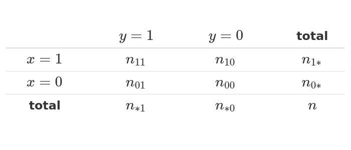

```{r setup, include=FALSE}
knitr::opts_chunk$set(echo = TRUE, comment = NA)

c1="#FF7F00"
c2="#FEB0C6"
c3="#034A94"
c4="#686868"
#-------------------------------------------------------------------------
library(tidyverse)
# install.packages("PerformanceAnalytics")
library(PerformanceAnalytics)


#install.packages("devtools") # solo una vez
# devtools::install_github("dgonxalex80/paqueteMET") # descarga paqueteDEG
library(paqueteMETODOS) # activa paqueteMET
data("biomasa") # carga la base biomasa

gen.corr.data<- function(rho,n){
x <- rnorm(n)
z <- rnorm(n)
y<- rho*x + sqrt(1-rho^2)*z
result <-cbind(y,x)
return(result)
}
#-------------------------------------------------------------------------
library(ggplot2)
library(patchwork)
Theme1= theme(axis.text.x = element_blank(),
        axis.text.y = element_blank(),
        axis.ticks = element_blank(),
        axis.title.x = element_text(size = 12),
        axis.title.y = element_text(size = 12))
#------------------------------------------------------------------------
Theme2= theme(
        #axis.text.x = element_blank(),
        #axis.text.y = element_blank(),
        #axis.ticks = element_blank(),
        axis.title.x = element_text(size = 11),
        axis.title.y = element_text(size = 11))

data(biomasa)
biomasa38=biomasa[,3:8]
#------------------------------------------------------------------------
# Fijamos semilla
set.seed(20)
# Generamos datos aleatorios para la variable X
X <- sample(c("Si", "No"), 100, replace = TRUE)
# "No" "Si" "Si" "No"  "No" "Si" "No" "Si" "No" "No"

# Generamos datos aleatorios para la variable Y
Y <- sample(c("Europa", "America", "Africa"), 100, replace = TRUE)
# "Europa" "Africa"  "Africa"  "Europa"  "Africa" 
# "Europa" "Europa"  "Europa"  "America" "America"

tabla <- table(X, Y)


```

</br></br>

## 

</br>

## <span style="color:#034a94">**Coeficiente de correlación de Spearman**</span>

Se considera como un coeficiente no paramétrico ( no requiere verificación de supuestos), propuesto por Charles Spearman y se basa en los rangos obtenidos para las variables $X$ y $Y$. 


</br></br>

<div class="content-box-blue">

$$\gamma_{s} = \dfrac{ \sum_{i=1}^{n}\Big[\big(  R_{i}(x) - \overline{R}(x)\big) \Big]}{\sqrt{\Bigg[ \sum_{i=1}^{n} \Big(R_{i}(x) - \overline{R}(x)\Big)^{2} \Bigg] \Bigg[ \sum_{i=1}^{n} \Big(R_{i}(y) - \overline{R}(y)\Big)^{2} \Bigg]}}$$
</div>


</br></br>

<div class="content-box-gray">
### <span style="color:#686868">**Nota**</span>

Los rangos se obtienen al ordenar los datos y asignarles a cada valor el número del orden correspondiente ($1,2,3,4,5...n$) $R_{i}(x)$ y $R_{i}(y)$

</div>


</br></br>


Para el caso de variables cualitativas existen varios indicadores para medir el grado de asociación entre ellas como son:

* **Phi**, **Coeficiente de contingencia**, **V de Cramer**, **Lambda**,  **Kappa** : para tablas de contingencia con variables cualitativas en escala nominal.

* **Gamma**, **Tau b de Kendall**, **Tau c de Kendal**, **D de Somers**  : para variables cualitativas en escala ordinal

* **Eta** : para tablas con variables de intervalo y nominal 


</br></br>


### <span style="color:#686868">**Código R**</span>


```{r}
library(paqueteMETODOS)
data(biomasa) # data contenida en  paqueteMET
head(biomasa) # primeros 6 registros de la data
cor(biomasa[,3:8]) %>%  # matriz de correlaciones 
  round(.,3      )

```
</br></br>

<div class="content-box-gray">
### <span style="color:#686868">**Nota**</span> 

</br>

* Los resultados se presenta como matriz simetrica que tiene identicos valores arriba y debajo de la diagonal. ($\rho_{ij} = \rho_{ji}$)
* Los valores de la diagonal son unos, debido a que $Cor(x,x)=1$
* Existen relaciones positivas y negativas, fuertes y medias

</div>

</br></br>

```{r, message=FALSE, warning=FALSE, fig.align='center'}
library(GGally)
ggpairs(biomasa[,5:8], title="Biomasa") 
```
<center>
**Figura 3.6** Matríz de correlaciones data biomasa
</center>

</br>

En esta matriz gráfica ademas de los diagramas de puntos que permiten visualizar el tipo de relación lineal entre las variables, permite visualizar la  distribución de cada variable, el valor de la correlación entre cada par de variables y su significancia sobre la prueba de hipótesis $Ho: \rho =0$ frente a $Ha: \rho \neq 0$.

En este caso todos los valores obtenidos son significativamente diferententes de cero.

</br></br>

Para el caso de variables cualitativas podemos utilizar los coeficientes $Phi$ o el de $Cramer$, a través de una tabla de contingencia o de doble entrada, por ejemplo:

</br>

<pre>
tabla = c(80,9,30,21) %>% 
           matrix(., nrow = 2) 
colnames(tabla)=c("Africa", "America")
rownames(tabla)=c("si", "no")


mosaicplot(tabla, cex = 1.1, col = c("#8ECAE6","#023047"), main = "Proyectos aprobados sistema alimentario")
</pre>

<center>
```{r, echo=FALSE, fig.align='center'}
tabla = c(80,9,30,21) %>% 
           matrix(., nrow = 2) 
colnames(tabla)=c("Africa", "America")
rownames(tabla)=c("si", "no")


mosaicplot(tabla, cex = 1.1, col = c("#8ECAE6","#023047"), main = "Proyectos aprobados sistema alimentario")
```
**Figura 3.7** Distribución de proyectos aprobados por continente <BR/>
Fuente : Ejemplo simulado para fines académicos

</center>

</br></br>

<!-- |           |   $y =1$      |  $y=0$         |  total           | -->
<!-- |:---------:|:-------------:|:--------------:|:----------------:| -->
<!-- | $x = 1$   |  $n_{11}$     | $n_{10}$       |  $n_{1*}$        | -->
<!-- | $x =0$    |  $n_{01}$     | $n_{00}$       |  $n_{0*}$        | -->
<!-- | **total** |  $n_{*1}$     | $n_{*0}$       |   $n$            | -->


</br></br>

## <span style="color:#034a94">**Coeficiente Phi**</span>

</br>

Tambien llamado coeficiente de Mathews, corresponde a un indicador de asociación entre dos variables binarias y está basado en el estadístico chi-cuadrado producto de una tabla cruzada o tabla de contingencia $2 \times 2$


```{r, echo=FALSE, out.width="60%", fig.align = "center"}

```

<div class="content-box-blue">

$$\phi = \dfrac{n_{11}\hspace{.1cm}n_{00}-n_{10}\hspace{.1cm}n_{01}}{\sqrt{n_{1*}\hspace{.1cm}n_{0*}\hspace{.1cm}n_{*0}\hspace{.1cm}n_{*1}}}$$

</div>

* Se aplica a tablas de contingencia 2x2

* Si los elementos estan concentrados en la diagonal de la tabla de contingencia, su valor será positivo, mientras que si se salen de esta diagonal su valor será negativo.

* Está relacionado con el estadístico chi-cuadrado de las tablas de contingencia 2x2. $\phi = \sqrt{\chi^2/n}$

</br></br>

```{r}

# install.packages("DescTools")
library(DescTools)
cat("Coeficiente Phi : ", Phi(tabla)) 
```

<br/><br/>

## <span style="color:#034a94">**Coeficiente V de Cramer**</span>

</br>


Mide la inensidad de la relación entre dos variables categóricas en terminos del tamaño de la chi-cuadrado de independencia.

* Es debil para valores inferiores a $0.2$ 
* Moderado para valores entre $0.2$ y $0.6$
* Es fuerte para valores superiores a $0.6$

<div class="content-box-blue">

$$V = \sqrt{\dfrac{\chi^2}{n(k-1)}}$$
</div>

Donde :

$n$ : total de observaciones en la tabla
$k$ : menor valor entre el número de filas menos 1 y el número de columnas menos 1


* Volor de cero indica que no hay relación entre las variables
* Valor de uno indica que existe una relación perfecta
* Valores entre 0.6 y 1 , indica que existe una relación fuerte entre las variables

</br></br>

```{r}

# install.packages("DescTools")
library(DescTools)
cat("Coeficiente V de Cramer :", CramerV(tabla)) 
```


Estos coeficientes varia entre $-1$  y $1$,  en este caso presentan un nivel bajo en  relación entre las variables.