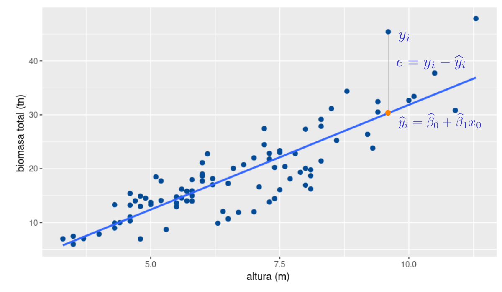

```{r setup, include=FALSE}
knitr::opts_chunk$set(echo = TRUE, comment = NA)

c1="#FF7F00"
c2="#=EB0C6"
c3="#034A94"
c4="#686868"

library(ggplot2)
library(paqueteMETODOS)
data(biomasa)
modelo=lm(log(bio_total) ~ diametro, data=biomasa)
```

</br></br>

## <span style="color:#034a94">**Estimación de los parámetros** </span>

</br>

Este método se base en la selección de los dos valores que conformen la recta (intercepto y pendiente) que mejor se ajuste a los datos. Para ello debe dar solución a un sistema de ecuaciones, denominadas ecuaciones normales. A continuación se plantea como funciona el métodos


<!-- ```{r, echo = F, message = F, fig.align = 'center', out.width = '100%'} -->
<!-- data(biomasa)  -->
<!-- ggplot(biomasa, aes(x=altura , y=bio_total))+ -->
<!--   geom_point(size=2, colour=c3)+ -->
<!--   geom_smooth(method = "lm",se=FALSE)+ -->
<!--   labs(title = "", y= "biomasa total (tn) ", x= "altura (m) ") -->
<!--  -->
<!-- ``` -->


</br>

```{r, echo=FALSE, out.width="80%", fig.align = "center"}

```
<center>
**Figura 3.9**  Identificación de residuales  
</center>

<br/><br/>

La diferencia entre el valor de $y$ asociado con un valor de $x_{0}$ y el valor estimado por la recta de regresión $\widehat{y}_{0}$ se denomina **resudual** y constituye una muestra de la variable aleatoria $\varepsilon$ 

</br>
<div class="content-box-blue">
$$e_i = y_{i} -\widehat{y}_{i}$$
</div>

</br>

El método consiste en encontrar los valores de $\beta_{0}$ y $\beta_{1}$ que minimice la suma de los cuadrados de los residuales

</br></br>

$$SCE = \sum_{i=1}^{n} e_{i}^2  = \sum_{i=1}^{n} \big(y_{i} - \widehat{y}_{i}\big)^2  = \sum_{i=1}^{n} \big( y_{i} - \widehat{\beta}_{0} - \beta_{1} x_{i}\big)^2$$
</br></br>

El objetivo del método es:


$$\min SCE = \dfrac{\partial SCE}{\partial \beta_{0}} = 0$$

$$\min SCE = \dfrac{\partial SCE}{\partial \beta_{1}} = 0$$
</br></br>

$$\dfrac{\partial \hspace{.2cm} \sum_{i=1}^{n} \big( y_{i} - \widehat{\beta}_{0} - \beta_{1} x_{i}\big)^2}{\partial \beta_{0}} = -2 \sum(y_{i} - \beta_{0}- \beta_{1} x_{i}) = 0$$

</br></br>

$$\dfrac{\partial \hspace{.2cm} \sum_{i=1}^{n} \big( y_{i} - \widehat{\beta}_{0} - \beta_{1} x_{i}\big)^2}{\partial \beta_{1}} = -2 \sum(y_{i} - \beta_{0}- \beta_{1} x_{i}) x_{i} = 0$$
</br></br>

Constituyendo un sistema de dos ecuaciones y dos incognitas, 

$$\sum_{i=1}^{n} y_{i} = n \widehat{\beta}_{0} + \widehat{\beta}_{1} \sum_{i=1}^{n} x_{i}$$

$$\sum_{i=1}^{n} y_{i} x_{i}= n \widehat{\beta}_{0} x_{i}+ \widehat{\beta}_{1} \sum_{i=1}^{n} x_{i}^{2}$$
</br></br>

Convirtiendose en el sistema :


$$
\begin{aligned}
n \widehat{\beta}_{0} + \widehat{\beta}_{1} \sum_{i=1}^{n} x_{i} & = & \sum_{i=1}^{n} y_{i} \hspace{1cm}\text{(1)}\\
\widehat{\beta}_{0} \sum_{i=1}^{n} x_{i} + \widehat{\beta}_{1} \sum_{i=1}^{n} x_{i}^{2} & = & \sum_{i=1}^{n} y_{i} x_{i}  \hspace{1cm}\text{(2)}
\end{aligned}
$$

</br></br>

De la ecuación $(1)$ se obtiene :

<div class="content-box-blue">

$$
\begin{aligned}
\widehat\beta_{0} & = &   \bar{y} - \widehat{\beta}_{1} \bar{x}\\
\end{aligned}
$$
</div>

</br></br>

<div class="content-box-blue">
$$
\begin{aligned}
\widehat\beta_{1} & =  \dfrac{n \displaystyle\sum_{i=1} x_{i}y_{i}  - \displaystyle\sum_{i=1}^{n} x_{i}  \displaystyle\sum_{i=1}^{n} y_{i}}{n \displaystyle\sum_{i=1}^{n} x_{i}^{2} - \bigg(\displaystyle\sum_{i=1}^{n}  x_{i}\bigg)^{2}} &   
\end{aligned}
$$
</div>

</br></br>


### <span style="color:#FF7F00">**Ejemplo**</span> 


Con el fin de estimar la relación existente entre el nivel de ingresos de una persona y el nivel de consumo, un investigador recolectó la siguiente información:

<br/>

|id   | 1   | 2   | 3   | 4   | 5   | 6   | 7   | 8   | 9   | 10  | 11  | 12  |
|:----|----:|----:|----:|----:|----:|----:|----:|----:|----:|----:|----:|----:|
|Ing  | 24.3|12.5 |31.2 |28.0 |35.1 |10.5 |23.2 |10.0 |8.5  |15.9 |14.7 |9.2  |
|Con  | 16.2|8.5  |15.0 |17.0 |24.2 |11.2 |15.0 |7.1  |3.5  |11.5 |10.7 |9.2  |


<br/>

Donde :

* **Id**  : identificador del hogar

* **x** : Ingresos familiares

* **y** : Consumo en viveres

<!-- ```{r } -->
<!-- id= 1:12 -->
<!-- x <- c(24.3, 12.5, 31.2, 28.0, 35.1, 10.5, 23.2,  10.0, 8.5, 15.9, 14.7, 9.2) -->
<!-- y <- c(16.2, 8.5, 15.0, 17.0, 24.2, 11.2, 15.0, 7.1, 3.5, 11.5, 10.7, 9.2) -->
<!-- xy=data.frame(id, x, y, x^2, y^2, x*y) -->
<!-- apply(xy, 2,sum) -->

<!-- ``` -->

<pre>
id       x       y         x2        y2         xy
 1       24.3    16.2      590.49    262.44     393.66
 2       12.5     8.5      156.25     72.25     106.25
 3       31.2    15.0      973.44    225.00     468.00
 4       28.0    17.0      784.00    289.00     476.00
 5       35.1    24.2     1232.01    585.64     849.42
 6       10.5    11.2      110.25    125.44     117.60
 7       23.2    15.0      538.24    225.00     348.00
 8       10.0     7.1      100.00     50.41      71.00
 9        8.5     3.5       72.25     12.25      29.75
10       15.9    11.5      252.81    132.25     182.85
11       14.7    10.7      216.09    114.49     157.29
12        9.2     9.2       84.64     84.64      84.64

suma   223.10  149.10     5110.47   2178.81    3284.46 
</pre>

<br/>

$$\widehat{\beta_{1}} = \dfrac{12 \times3284.46 - (223.10 \times 149.10)}{12 \times 5110.47 - (223.10)^2} = \dfrac{6149.31}{11552.03} = 0.5323142 $$
<br/>

$$\widehat{\beta_{0}} = 12.425 - 0.5323142 \times 18.59167 = 2.528392$$

<br/>


Modelo estimado :

$$\widehat{y_{i}} =2.528392 + 2.528392 \hspace{.2cm} x_{i}$$ 


<br/><br/>

### <span style="color:#034a94">**Validación de forma computacional**<span>

<br/>
```{r}
id <- 1:12
x <- c(24.3, 12.5, 31.2, 28.0, 35.1, 10.5, 23.2,  10.0, 8.5, 15.9, 14.7, 9.2) 
y <- c(16.2, 8.5, 15.0, 17.0, 24.2, 11.2, 15.0, 7.1, 3.5, 11.5, 10.7, 9.2) 
summary(lm(y~ x ))
```


