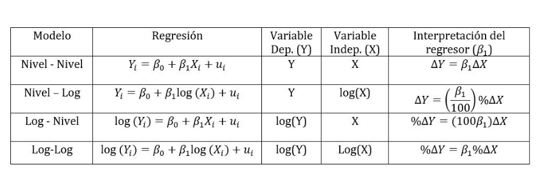
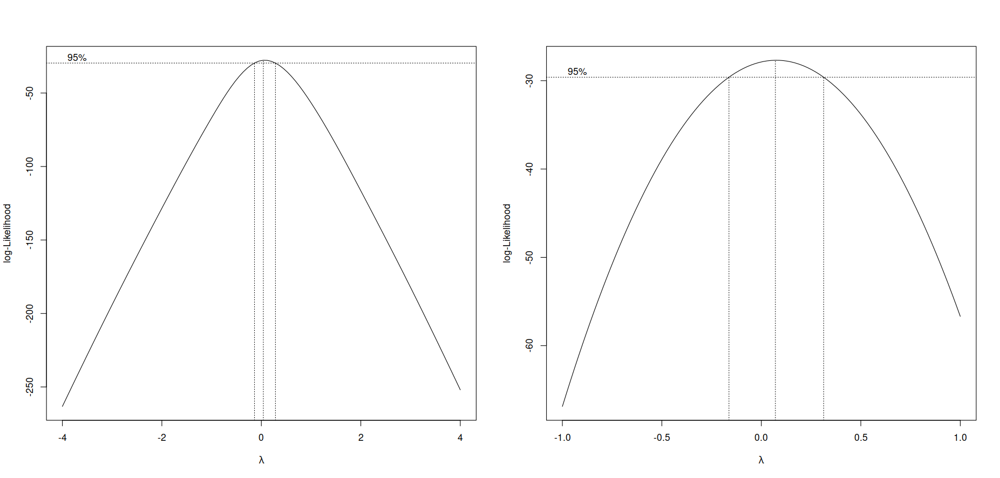

```{r setup, include=FALSE}
knitr::opts_chunk$set(echo = TRUE, comment = NA)

c1="#FF7F00"
c2="#=EB0C6"
c3="#034A94"
c4="#686868"
library(vembedr)
library(tidyverse)
library(MASS)

library(ggplot2)
library(paqueteMETODOS)
data(biomasa)
modelo=lm(log(bio_total) ~ diametro, data=biomasa)
```

</br></br>


## <span style="color:#034a94">**Transformación de variables**</span>

</br>

En algunos casos el modelo lineal no es apropiado para ajustar los datos y por tanto no cumple los supuestos sobre los errores. Es necesario entonces probar otro tipo de modelo transformando las variables. 

```{r, echo=FALSE, message=FALSE, warning=FALSE, fig.align='center'}
library(ggplot2)

# Crear un conjunto de datos para x
x <- seq(0.1, 5, by = 0.1)

# Parámetros para las funciones
beta0 <- 1
beta1 <- 0.5

# Calcular los valores de y para las cuatro funciones
y1 <- beta0 * x^beta1
y2 <- beta0 * exp(beta1 * x)
y3 <- beta0 + beta1 * log(x)
y4 <- x / (beta0 * x - beta1)

# Crear un data frame con los datos
df <- data.frame(x, y1, y2, y3, y4)

# Crear el gráfico de 2x2
p1 <- ggplot(df, aes(x)) +
  geom_line(aes(y = y1), color =  "#FF7F00", linetype = "solid", size = 2) +
  labs(title = expression(paste("Función ", y == beta[0]*x^beta[1])),
       x = "x",
       y = "y") +
  theme_minimal()

p2 <- ggplot(df, aes(x)) +
  geom_line(aes(y = y2), color = "#FF7F00", linetype = "solid", size = 2) +
  labs(title = expression(paste("Función ", y == beta[0]*e^(beta[1]*x))),
       x = "x",
       y = "y") +
  theme_minimal()

p3 <- ggplot(df, aes(x)) +
  geom_line(aes(y = y3), color =  "#FF7F00", linetype = "solid", size = 2) +
  labs(title = expression(paste("Función ", y == beta[0] + beta[1]*log(x))),
       x = "x",
       y = "y") +
  theme_minimal()

p4 <- ggplot(df, aes(x)) +
  geom_line(aes(y = y4), color =  "#FF7F00", linetype = "solid", size = 2) +
  labs(title = expression(paste("Función ", y == frac(x, beta[0]*x - beta[1]))),
       x = "x",
       y = "y") +
  theme_minimal()

# Organizar los gráficos en una cuadrícula de 2x2
library(gridExtra)
grid.arrange(p1, p2, p3, p4, ncol = 2, nrow = 2)
```

</br></br>


Dentro de las transformaciones más empleadas están:

</br>

<center>
**Tabla 3.2**  Funciones linealizables
</center>

| función linealizable                  | Transformación                          | forma lineal   |
|:--------------------------------------|:----------------------------------------|:----------------------------------------|
| $y= \beta_{0} x^{\beta_{1}}$          | $y^*=\log(y)$,  $x^*=log(x)$             | $y^*=  \log (\beta_{0}) + \beta_{1} x^*$|
| $y = \beta_{0} e^{\beta_{1}x}$        | $y^*=\ln(y)$                             | $y^* = \ln(\beta_{0}) + \beta_{1} x$|
| $y = \beta_{0} + \beta_{1} log (x)$   | $x^*=\log(x)$                            |  $y^* = \beta_{0} + \beta_{1} x$|
| $y = \dfrac{x}{\beta_{0}x -\beta_{1}}$| $y^*=\dfrac{1}{y}$,  $x^*=\dfrac{1}{x}$ |  $y^* = \beta_{0} + \beta_{1} x^*$|
|                                       |                                         |                                   |


<br/><br/>

<center>
**Tabla 3.3** Transformación de variables e interpretación de $\beta_{1}$ 

| Modelo    |  Regresión                                             | Variable dependiente| Variable independiente| Interpretación de $\beta_{1}$  |
|:-----------|:-------------------------------------------------------|:------------------:|:---------------------:|:-------------------------------|
| `Lin-Lin` | $\hspace{.8cm} Y_{i} = \beta_{0}+ \beta_{1} X_{i} + \varepsilon_{i}$| $Y$                 |  $X$                  | $\Delta Y = \beta_{1}  \hspace{.2cm}\Delta X$|
| `Lin-Log` | $\hspace{.8cm} Y_{i} = \beta_{0}+ \beta_{1} \log(X_{i}) + \varepsilon_{i}$| $Y$           |  $\log(X)$            | $\Delta Y = (\beta_{1} / 100) \% \hspace{.2cm}\Delta X$|
| `Log-Lin` | $\hspace{.8cm} \log(Y_{i}) = \beta_{0}+ \beta_{1} X_{i} + \varepsilon_{i}$| $\log(Y)$     |  $X$                  | $\%\Delta Y = (100 \beta_{1}) \hspace{.2cm}\Delta X$|
| `Log-Log` | $\hspace{.8cm} \log(Y_{i}) = \beta_{0}+ \beta_{1} \log(X_{i}) + \varepsilon_{i}$| $\log(Y)$|  $\log(X)$           | $\%\Delta Y = \beta_{1}\% \hspace{.2cm}\Delta X$||
||||||

<!--```{r, echo=FALSE, out.width="100%", fig.align = "center"} -->
<!-- -->
<!--``` -->

</center>


</br></br>


### <span style="color:#FF7F00">**Ejemplo**</span> 

</br>


```{r, echo=FALSE, fig.align='center'}
library(paqueteMETODOS)
library(ggplot2)
data("biomasa")

# Crear el gráfico con ggplot2
ggplot(biomasa, aes(x = diametro, y = bio_total)) +
  geom_point(color = "#FF7F00", size =2) +  # Usar puntos para representar los datos
  labs(title = "Gráfico de Biomasa",
       x = "Diámetro",
       y = "Biomasa Total") +
  theme_minimal()


```

</br>

Como se puede observar existe una leve curvatura de los puntos que permite sospechar que existen mejores ajustes que el de la línea recta.

</br></br>

### <span style="color:#034a94">**Transformación de variables**</span>

```{r}
library(paqueteMETODOS)
data("biomasa")
modelo1=lm(bio_total ~ diametro, data=biomasa)           # Lin - Lin
modelo2=lm(bio_total ~ log(diametro), data=biomasa)      # Lin - Log
modelo3=lm(log(bio_total) ~ diametro, data=biomasa)      # Log - Lin
modelo4=lm(log(bio_total) ~ log(diametro), data=biomasa) # Log - Log
```

</br></br>

```{r, echo=FALSE, message=FALSE, warning=FALSE}
library(stargazer)
stargazer(modelo1, modelo2, modelo3, modelo4, type="text", df=FALSE)
```

</br></br>

### <span style="color:#034a94">**Transformación Box-Cox**</span>

</br>

La transformación de la variable respuesta $Y$ es útil para dar solución a problemas tanto de validación de suspuesto como también de mejoras en el nivel de ajuste del modelo. Poder detectar cuál de las anteriores trasformaciones es la más apropiada podría se un trabajo de error ensayo, probando una a una las transformaciones, generando una de manda de tiempo.

El método de box-cox permite encontrar el valor de $\lambda$ óptimo para la función :

$$g_{\lambda}(y) = \left \{ \begin{matrix} \dfrac{y^{\lambda}-1}{y} & \mbox{ si } \lambda \neq 0\\ 
                                     &  \\
                                     log(y)  & \mbox{ si } \lambda =0 \end{matrix}\right.$$

El valor $\dfrac{y^{\lambda}-1}{y}$ se puede simplificar por $y^{\lambda}$ cuando el modelo es predictivo. El valor máximo de este valor podrá orientar sobre la forma funcional de la variables respuesta.

La función `boxcox()`, del paquete `MASS` nos ayuda a encontrar el valor óptimo de $\lambda$

La siguiente tabla nos ayuda a identificar la transformación apropiada

</br></br>

<div class="content-box-blue">
|                         |           |           |             |           |           |           |            |
|:------------------------|:----------|:----------|:------------|:----------|:----------|:----------|:-----------|
| $\lambda \hspace{1.5cm}$|   -2      |  -1       |   -0.5      |      0    |  0.5      |    1      |  2         |
| Transformación          | $1/y^{2}$ | $1/y$     | $1/\sqrt{y}$| $log(y)$  | $\sqrt{y}$|   $y$     | $y^{2}$    |
</div>

</br></br>

```{r, eval=FALSE, message=FALSE, warning=FALSE, fig.align='center'}
library(paqueteMETODOS)
data(biomasa)
modelo1=lm(bio_total ~ diametro, data=biomasa)
summary(modelo1)
par(mfrow = c(1,2))
boxcox(lm(biomasa$bio_total ~ biomasa$diametro, data=biomasa), lambda = -3:3)
#Se repite el proceso pero esta vez entrechando el rango de valores de lambda 
bc<-boxcox(lm(biomasa$bio_total ~ biomasa$diametro), lambda = -1:1)
(lambda <- bc$x[which.max(bc$y)])
```


```{r, echo=FALSE, out.width="100%", fig.align = "center"}

```

<center>
**Figura 3.10**  Valor optimo de $\lambda$
</center>

<br/><br/>


El resultado  ($\lambda =0$) indica que la variable dependiente debe estar en escala logarítmica


