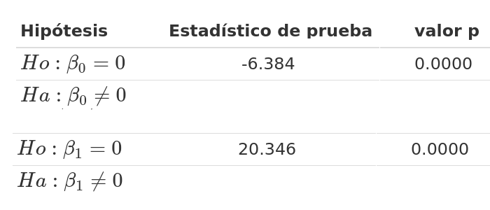

---
title: <span style="color:#034a94"> **Código R - Modelo**</span>
author: "Métodos y Simulación Estadística"
output: html_document
css: style.css
---

```{r setup, include=FALSE}
knitr::opts_chunk$set(echo = TRUE, comment = NA)

c1="#FF7F00"
c2="#=EB0C6"
c3="#034A94"
c4="#686868"

library(ggplot2)
library(paqueteMETODOS)
data(biomasa)
modelo=lm(log(bio_total) ~ diametro, data=biomasa)
```

</br></br>

A continuación se presenta el código en R para estimar el modelo y validar los supuestos más importantes

</br>

### <span style="color:#034a94">**Estimación MCO**</span>

```{r, eval=FALSE}
library(paqueteMETODOS)
data(biomasa)
modelo=lm(bio_total ~ diametro, data=biomasa)
summary(modelo)
```

Los resultados se presentan en cuatro partes :

</br></br>

### <span style="color:#034A94">**Formula del modelo**</span>

$$\widehat{\text{bio_total}_{i}} = \widehat{\beta}_{0} + \widehat{\beta}_{1} \hspace{.2cm}\text{diametro}_{i}$$


<pre>
Call:
lm(formula = log(bio_total) ~ diametro, data = biomasa)
</pre>

</br></br>

### <span style="color:#034A94">**Estadística de los residuales**</span>

<pre>
Residuals:
    Min      1Q  Median      3Q     Max 
-6.3775 -2.6594  0.0237  1.8758 11.9876 
</pre>

</br></br>

### <span style="color:#034A94">**Coeficientes estimados**</span>

<pre>
Coefficients:
            Estimate Std. Error t value Pr(>|t|)    
(Intercept)  -9.0203     1.4129  -6.384 7.86e-09 ***
diametro      5.1026     0.2508  20.346  < 2e-16 ***
---
Signif. codes:  0 ‘***’ 0.001 ‘**’ 0.01 ‘*’ 0.05 ‘.’ 0.1 ‘ ’ 1
</pre>

</br>

$$\widehat{\text{bio_total}_{i}} = -9.0203 + 5.1026 \hspace{.2cm} \text{diametro}_{i}$$
Además se presentan los resultados de las pruebas de hipótesis individuales sobre los coeficientes:

<!-- | Hipótesis             |  Estadístico de prueba        |   valor p            | -->
<!-- |:----------------------|:------------------------------|:---------------------| -->
<!-- $Ho: \beta_{0} = 0$     |   -6.384                      |  0.0000              | -->
<!-- $Ha: \beta_{0} \neq 0$  |                               |                      | -->
<!-- |                       |                               |                      | -->
<!-- |$Ho: \beta_{1} = 0$    |   20.346                      |  0.0000              | -->
<!-- |$Ha: \beta_{1} \neq 0$ |                               |                      | -->

```{r, echo=FALSE, out.width="50%", fig.align = "center"}

```

</br></br>

### <span style="color:#034A94">**Indicadores de ajuste**</span>

<pre>
Residual standard error: 3.435 on 88 degrees of freedom
Multiple R-squared:  0.8247,	Adjusted R-squared:  0.8227 
F-statistic:   414 on 1 and 88 DF,  p-value: < 2.2e-16
</pre>


Este resultado muestra el valor del coeficiente de determinación ($R^2$) que corresponde al porcentaje de la variabilidad de $Y$ explicada por el modelo. Para el ejemplo $R^{2} = 0.8227$. indicando que el modelo explica un 82.27% de la variación de $Y$.

</br></br>

## <span style="color:#034a94">**Validación de supuestos**</span>

</br></br>

### <span style="color:#034A94">**Normalidad**</span>

</br>

$H_o:  \varepsilon \sim Normal$

$H_a:  \varepsilon \hspace{.2cm} \text{ no } \sim Normal$

</br></br>

#### <span style="color:#686868">**Test de Shapiro - Wilk**</span>

</br>

```{r, message=FALSE, warning=FALSE}
shapiro.test(modelo$residuals)

```

</br></br>

#### <span style="color:#686868">**Test de Jarque-Bera**</span>

</br>

```{r, message=FALSE, warning=FALSE}
# install.packages("normtets")
# devtools::install_github("UBC-MDS/noRmtest", build_opts = c("--no-resave-data", "--no-manual"))
# https://cran.r-project.org/src/contrib/Archive/normtest/
 library(normtest)
normtest::jb.norm.test(modelo$residuals)
```

</br></br>

#### <span style="color:#686868">**Test de Anderson-Darling**</span>

</br>

```{r, message=FALSE, warning=FALSE}
# install.packages("nortets")
nortest::ad.test(modelo$residuals)
```

</br></br>

#### <span style="color:#686868">**Test de  Lilliefors (Kolmogorov-Smirnov)**</span>

</br>

```{r}
nortest::lillie.test(modelo$residuals)
```

</br></br>

### <span style="color:#034A94">**Varianza contante**</span>

</br>

$Ho : V[\varepsilon_{i}] = \sigma^2$

$Ha : V[\varepsilon_{i}] \neq \sigma^2$

</br></br>

#### <span style="color:#686868">**Test de Breusch-Pagan**</span>

</br>

```{r, message=FALSE, warning=FALSE}
lmtest::bptest(modelo)
```

</br></br>

#### <span style="color:#686868">**Test de Goldfeld-Quandt**</span>

</br>

```{r, message=FALSE, warning=FALSE}
lmtest::gqtest(modelo)
```

</br></br>

### <span style="color:#034A94">**No autocorrelación de errores**</span>

</br>

$Ho : E[\varepsilon_{i}, \varepsilon_{j}] = 0$

$Ha : E[\varepsilon_{i}, \varepsilon_{j}] \neq  0$

</br>

#### <span style="color:#686868">**Test de Durbin-Watson**</span>

</br>

```{r, message=FALSE, warning=FALSE}
lmtest::dwtest(modelo)
```

</br></br>

### <span style="color:#034a94">**Transformación de variables**</span>

```{r}
library(paqueteMETODOS)
data("biomasa")
modelo1=lm(bio_total ~ diametro, data=biomasa)           # Lin - Lin
modelo2=lm(bio_total ~ log(diametro), data=biomasa)      # Lin - Log
modelo3=lm(log(bio_total) ~ diametro, data=biomasa)      # Log - Lin
modelo4=lm(log(bio_total) ~ log(diametro), data=biomasa) # Log - Log
```


```{r, message=FALSE, warning=FALSE}
library(stargazer)
stargazer(modelo1, modelo2, modelo3, modelo4, type="text", df=FALSE)
```

<br/>

Los mejores indicadores los tiene el modelo (3) : log - lin


$$\widehat{\log(bio-total_{i})} = 1.328 + 0.278 \hspace{.3cm} diametro_{i}$$


