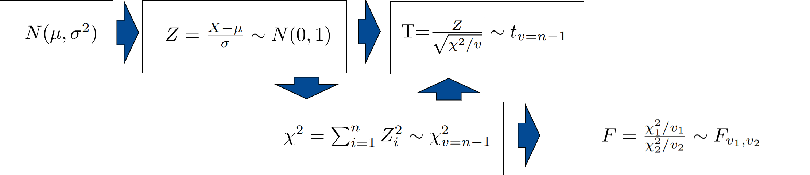

```{r setup, include=FALSE}
knitr::opts_chunk$set(echo = TRUE, comment = NA)
if(!require(pacman)){install.packages("pacman"); library(pacman)}
pacman::p_load("tidyverse", "ggplot2", "pBrackets", "knitr", "HH", "car", "rgl", "sampling")
library(vembedr)

c1="#FF7F00"
c2="#=EB0C6"
c3="#034A94"
c4="#686868"

library(ggplot2)
library(paqueteMETODOS)
data(biomasa)
modelo=lm(log(bio_total) ~ diametro, data=biomasa)

```


</br></br>

Después de estimar el modelo por el método de MCO y haber verificado el cumplimiento de los supuestos podemos realizar inferencias sobre los resultados obtenidos.

En este caso es posible que estemos ineresados en estimar el valor de la mendiente o el intercepto, pero además requerimos realizar pruebas de hipotesis sobre los valores estimados y sobre los valores pronosticados.

</br>

* Intervalos de confianza sobre el intercepto ($\beta_{0}$) y sobre la pendiente ($\beta_{1}$). 

* Pruebas de hipótesis sobre los parámetros $\beta_{0}$ y $\beta_{1}$, con el fin de validar si los valores estimados a partir de la muestra son estadísticamente significativos ($Ho:  \beta_{i} =0$ vs $Ha: \beta_{i} \neq 0$).
* Intervalos de confianza sobre la respuesta media para un determinado valor de la variable independiente ($\widehat{y_{i}}$)

</br>

Estos resultados están basados en la distribución normal de los errores, la existencia de homoscedasticidad (varianza constante de los errores) , la no correlación de errores (independencia de errores)  y la no existencia de multicolinealidad (relación fuerte entre las variables independientes) 

</br>

```{r, echo=FALSE, out.width="100%", fig.align = "center"}

```
<center>
**Figura 3.11** Relación entre distirbuciones muestrales
</center>

</br></br>

Se parte de una variable condistribución normal $X$, con media $\mu$ y varianza $\sigma^2$. Esta variable se puede estandarizar, restandole su media y dividiendola por su desviación estandar, transformandola en otra variable denominada $Z$. A esta variable se le denomina normal estandar dado que tiene media cero y varianza uno. 

La suma de $n$ variables normales estandar, cada una de ellas elevadas al cuadrado, originan una variable $\chi^2$ (chi-cuadrado). 

La razón de una variable normal estandar con la raiz cuadrada de una variable chi-cuadrado sobre sus grados de libertad, da origen a un variable T con distribución t-Student.

Por último la razón de dos variables chi-cuadrado, origina una variable F con distribución F-Fisher

A este grupo de distribuciones se les denomina distribuciones de probabilidad muestrales


</br>